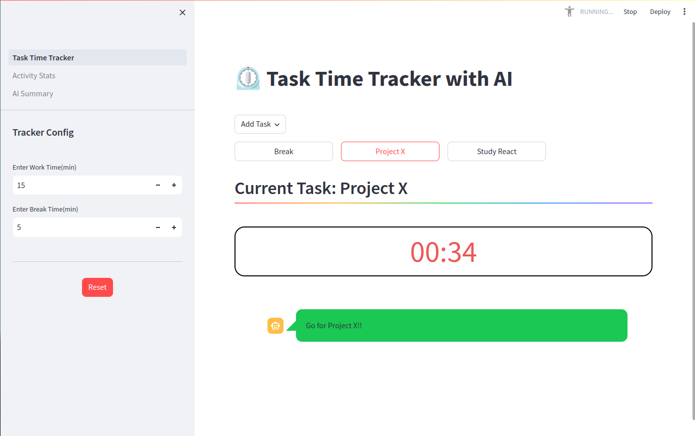

# Time Tracking App with AI
This application helps users track their tasks, get AI feedback, and see their activities' visualized data.

## Background 
This application was built for the Hackathon ["The Future of AI is Open"](https://arctic-streamlit-hackathon.devpost.com/rules) by Snowflake.

## How to run locally
1. Run `pip install -r requirements.txt` in your virtual environment 
2. Run `streamlit run Task_Time_Tracker.py`
3. If you like to add AI summary feature, you need to add your replicate API token to `.streamlit/secrets.toml`, or add it from the main page.

## Demo Video 
[Video](https://www.youtube.com/watch?v=9Ft8U0jzD_k)
## Used Technologies
- Python
- Streamlit 
- Replicate(API)